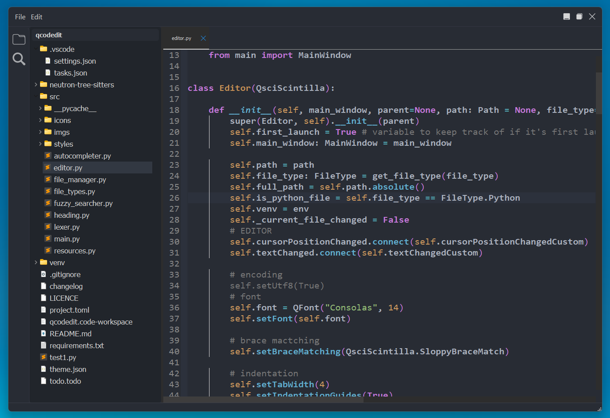

# Neutron
Neutron is a code editor for the Python programming language. 
Created using PyQt5 and QScintilla.

## Screenshots

## Todo
- Find and replace
- Update syntax higlighters using tree sitter
- More language support
- Custom Icons for file types
- App icon
- More Customization
- Settings Panel along with more side buttons/panels
- Extensions?
- More Themes
- Git integration
- Language server intregration
- More documentation
